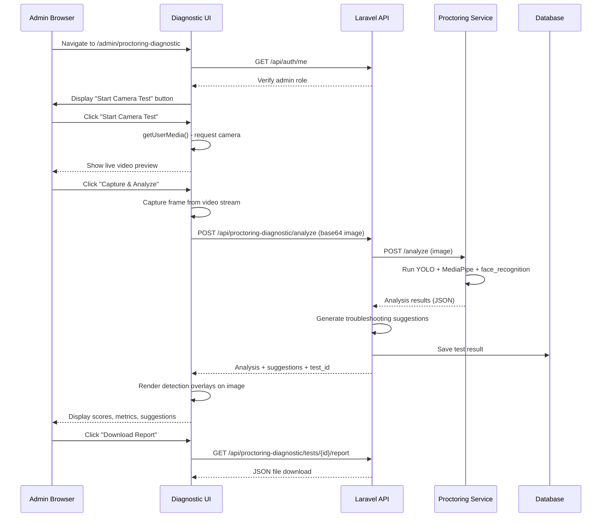

# Design: Proctoring Diagnostic Tool

## Overview

The Proctoring Diagnostic Tool is an admin-only web interface that enables real-time testing and validation of the proctoring system's AI components (YOLO object detection, MediaPipe face detection, head pose estimation, eye gaze tracking, and face_recognition identity verification). The tool provides:

- **Real-time camera preview and capture** for instant testing
- **Comprehensive AI component analysis** with visual overlays and detailed metrics
- **Automated troubleshooting suggestions** based on test results
- **Test history and reporting** for tracking system health over time
- **Live component health monitoring** with automatic status checks
- **Interactive testing scenarios** for validating specific detection capabilities

This tool addresses the critical need for admins to quickly verify that the proctoring system is functioning correctly and troubleshoot issues without requiring deep technical knowledge or manual debugging.

### Design Goals

1. **Immediate Feedback**: Provide instant visual confirmation of AI detection accuracy
2. **Actionable Insights**: Generate specific, step-by-step troubleshooting recommendations
3. **Non-Technical UX**: Make complex AI diagnostics accessible to non-developers
4. **Historical Tracking**: Enable trend analysis and issue pattern recognition
5. **Comprehensive Coverage**: Test all proctoring components in a single interface

## Architecture

### High-Level System Architecture

```
┌─────────────────────────────────────────────────────────────────┐
│                    Client Layer (Browser)                        │
├─────────────────────────────────────────────────────────────────┤
│  📱 Diagnostic UI (React/Next.js)                               │
│  ├─ Camera Preview Component                                    │
│  ├─ AI Analysis Results Display                                 │
│  ├─ Visual Detection Overlay (Canvas)                           │
│  ├─ Troubleshooting Suggestions Panel                           │
│  ├─ Test History Table                                          │
│  └─ Live Health Status Dashboard                                │
└─────────────────────────────────────────────────────────────────┘

                    ↕ HTTPS (POST /api/proctoring/analyze)
                    ↕ HTTPS (GET /api/proctoring-diagnostic/*)
                    ↕ WebSocket (health status updates)

┌─────────────────────────────────────────────────────────────────┐
│                   Backend API Layer (Laravel)                    │
├─────────────────────────────────────────────────────────────────┤
│  🔐 Admin Authorization Middleware                              │
│  📊 ProctoringDiagnosticController                              │
│  ├─ analyzeCapture() - Forward to Python service               │
│  ├─ saveTestResult() - Store to database                       │
│  ├─ getTestHistory() - Retrieve past tests                     │
│  ├─ downloadReport() - Generate JSON report                    │
│  └─ getHealthStatus() - Check service availability             │
│  🛠️ TroubleshootingEngine                                       │
│  └─ generateSuggestions() - Rule-based issue detection         │
└─────────────────────────────────────────────────────────────────┘
                    ↕ HTTP (POST /analyze)
                    ↕ HTTP (GET /health)

┌─────────────────────────────────────────────────────────────────┐
│              Proctoring Service (Python/FastAPI)                 │
├─────────────────────────────────────────────────────────────────┤
│  🤖 AI Analysis Engine                                          │
│  ├─ YOLOv8 Object Detection                                    │
│  ├─ MediaPipe Face Detection                                   │
│  ├─ Head Pose Estimation                                       │
│  ├─ Eye Gaze Detection                                         │
│  └─ face_recognition Embedding Extraction                      │
│  📝 Response Formatter                                          │
│  └─ Return component scores + detection metadata               │
└─────────────────────────────────────────────────────────────────┘
                    ↕ Database writes (test results)

┌─────────────────────────────────────────────────────────────────┐
│                   Data Layer (MySQL + Redis)                     │
├─────────────────────────────────────────────────────────────────┤
│  📦 proctoring_diagnostic_tests (MySQL)                         │
│  ├─ Test results with timestamps                               │
│  ├─ Component scores and metadata                              │
│  └─ Admin who ran the test                                     │
│  🔴 Redis Cache                                                 │
│  └─ Health check results (TTL: 10s)                            │
└─────────────────────────────────────────────────────────────────┘
```


### Component Interaction Flow



## Components and Interfaces

### Frontend Components

#### 1. DiagnosticPage Component
**Location**: `src/app/admin/proctoring-diagnostic/page.tsx`

**Responsibilities**:
- Route protection (admin-only)
- Page layout and state management
- Orchestrates child components

**State**:
```typescript
interface DiagnosticPageState {
  testStatus: 'idle' | 'capturing' | 'analyzing' | 'complete' | 'error';
  currentTest: TestResult | null;
  testHistory: TestResult[];
  healthStatus: SystemHealth;
}
```


#### 2. CameraPreviewComponent
**Location**: `src/components/diagnostic/CameraPreview.tsx`

**Responsibilities**:
- Request camera permissions via navigator.mediaDevices.getUserMedia()
- Display live video stream
- Show camera status (Active, Permission Denied, Not Found)
- Display resolution information
- Provide "Capture & Analyze" button when camera is active

**Props**:
```typescript
interface CameraPreviewProps {
  onCapture: (imageBlob: Blob) => Promise<void>;
  onPermissionDenied: () => void;
  onError: (error: string) => void;
}
```

**State**:
```typescript
interface CameraState {
  status: 'idle' | 'requesting' | 'active' | 'denied' | 'error';
  stream: MediaStream | null;
  resolution: { width: number; height: number } | null;
  errorMessage: string | null;
}
```

#### 3. AnalysisResultsComponent
**Location**: `src/components/diagnostic/AnalysisResults.tsx`

**Responsibilities**:
- Display overall health score (0-100) with color coding
- Show individual component scores (YOLO, MediaPipe, head pose, eye gaze, face embedding)
- Render confidence levels and detection counts
- Display processing time
- Show detected objects/faces list

**Props**:
```typescript
interface AnalysisResultsProps {
  result: AnalysisResult;
  onDownloadReport: (testId: number) => void;
}

interface AnalysisResult {
  test_id: number;
  overall_health_score: number; // 0-100
  overall_status: 'healthy' | 'warning' | 'critical';
  components: {
    object_detection: ComponentScore;
    face_detection: ComponentScore;
    head_pose: ComponentScore;
    eye_gaze: ComponentScore;
    face_embedding: ComponentScore;
  };
  detected_objects: DetectedObject[];
  detected_faces: DetectedFace[];
  processing_time_ms: number;
  timestamp: string;
}

interface ComponentScore {
  status: 'success' | 'failure' | 'degraded';
  score: number; // 0-100
  confidence: number; // 0-1
  details: Record<string, any>;
}
```


#### 4. DetectionOverlayComponent
**Location**: `src/components/diagnostic/DetectionOverlay.tsx`

**Responsibilities**:
- Render captured image on HTML canvas
- Draw bounding boxes with color coding (red=prohibited, yellow=suspicious, green=allowed)
- Show labels with confidence percentages
- Draw facial landmarks (toggleable)
- Render head pose direction arrows
- Show eye gaze indicators
- Display face count badge

**Props**:
```typescript
interface DetectionOverlayProps {
  imageUrl: string;
  detections: {
    objects: DetectedObject[];
    faces: DetectedFace[];
  };
  showLandmarks: boolean;
  onToggleLandmarks: () => void;
}

interface DetectedObject {
  class: string;
  confidence: number;
  bbox: [number, number, number, number]; // x1, y1, x2, y2
  severity: 'prohibited' | 'suspicious' | 'allowed';
}

interface DetectedFace {
  bbox: [number, number, number, number];
  landmarks?: Array<[number, number]>;
  head_pose: {
    yaw: number;
    pitch: number;
    roll: number;
  };
  eye_gaze: {
    left_ratio: number;
    right_ratio: number;
  };
  embedding_present: boolean;
  embedding_dimensions?: number;
}
```

#### 5. TroubleshootingSuggestionsComponent
**Location**: `src/components/diagnostic/TroubleshootingSuggestions.tsx`

**Responsibilities**:
- Display categorized issues (Camera, Network, Configuration, Performance)
- Show severity badges (Critical, Warning, Info)
- Render step-by-step action instructions
- Provide copy-to-clipboard for technical details
- Show "All systems operational" when no issues

**Props**:
```typescript
interface TroubleshootingProps {
  suggestions: TroubleshootingSuggestion[];
}

interface TroubleshootingSuggestion {
  category: 'camera' | 'network' | 'configuration' | 'performance';
  severity: 'critical' | 'warning' | 'info';
  issue: string;
  description: string;
  action: string;
  technical_details?: string;
  related_config?: string[];
  documentation_link?: string;
}
```


#### 6. TestHistoryComponent
**Location**: `src/components/diagnostic/TestHistory.tsx`

**Responsibilities**:
- Display last 10 test results in collapsible cards
- Show timestamp with timezone
- Display overall health score with color coding
- Show component-level pass/fail icons
- Display issue count
- Show admin who ran the test
- Provide "Compare" functionality for two tests
- Render trend chart when ≥3 tests exist

**Props**:
```typescript
interface TestHistoryProps {
  tests: HistoricalTest[];
  onCompare: (testId1: number, testId2: number) => void;
}

interface HistoricalTest {
  id: number;
  timestamp: string;
  overall_health_score: number;
  component_status: Record<string, 'pass' | 'fail'>;
  issues_count: number;
  admin_name: string;
}
```

#### 7. LiveHealthMonitorComponent
**Location**: `src/components/diagnostic/LiveHealthMonitor.tsx`

**Responsibilities**:
- Poll health endpoints every 10 seconds
- Display service status cards (Backend API, Proctoring Service, Database, Queue Workers)
- Show response times
- Display service version numbers
- Show proctoring service details (YOLO loaded, MediaPipe loaded, face_recognition loaded, device)
- Display last check timestamp
- Show notification toast on status changes

**Props**:
```typescript
interface LiveHealthProps {
  autoRefresh: boolean;
  refreshInterval: number; // milliseconds
}

interface SystemHealth {
  backend_api: ServiceStatus;
  proctoring_service: ProctoringServiceStatus;
  database: ServiceStatus;
  queue_workers: QueueStatus;
  last_check: string;
}

interface ServiceStatus {
  status: 'healthy' | 'degraded' | 'down';
  response_time_ms: number | null;
  version?: string;
  message?: string;
}

interface ProctoringServiceStatus extends ServiceStatus {
  yolo_loaded: boolean;
  mediapipe_loaded: boolean;
  face_recognition_loaded: boolean;
  device: 'cpu' | 'gpu';
}

interface QueueStatus extends ServiceStatus {
  worker_count: number;
  status: 'running' | 'slow' | 'stopped';
}
```


#### 8. InteractiveScenarioTesterComponent
**Location**: `src/components/diagnostic/InteractiveScenarioTester.tsx`

**Responsibilities**:
- Provide pre-defined scenario buttons
- Display scenario-specific instructions overlay
- Validate scenario requirements in analysis results
- Show pass/fail verdict with explanations
- Support "Run All Scenarios" sequential execution
- Display countdown timers between scenarios

**Props**:
```typescript
interface ScenarioTesterProps {
  onRunScenario: (scenario: TestScenario) => Promise<ScenarioResult>;
  onRunAllScenarios: () => Promise<void>;
}

type TestScenario = 
  | 'object_detection' 
  | 'multi_face' 
  | 'head_turning' 
  | 'identity_baseline' 
  | 'identity_mismatch';

interface ScenarioResult {
  scenario: TestScenario;
  verdict: 'pass' | 'fail';
  explanation: string;
  requirements_met: string[];
  requirements_failed: string[];
}
```

### Backend Components

#### 1. ProctoringDiagnosticController
**Location**: `backend/app/Http/Controllers/Api/ProctoringDiagnosticController.php`

**Methods**:

```php
/**
 * Analyze captured frame
 * POST /api/proctoring-diagnostic/analyze
 */
public function analyzeCapture(Request $request): JsonResponse
{
    // 1. Validate admin role
    // 2. Validate image (base64 or file upload)
    // 3. Forward image to proctoring service
    // 4. Parse analysis response
    // 5. Generate troubleshooting suggestions
    // 6. Save test result to database
    // 7. Return comprehensive result
}

/**
 * Get test history
 * GET /api/proctoring-diagnostic/tests
 */
public function getTestHistory(Request $request): JsonResponse
{
    // 1. Validate admin role
    // 2. Retrieve last 10 tests from database
    // 3. Format timestamps with timezone
    // 4. Return test list
}

/**
 * Get single test result
 * GET /api/proctoring-diagnostic/tests/{id}
 */
public function getTestResult(int $id): JsonResponse
{
    // 1. Validate admin role
    // 2. Retrieve test from database
    // 3. Return detailed result
}
```


```php
/**
 * Download test report as JSON
 * GET /api/proctoring-diagnostic/tests/{id}/report
 */
public function downloadReport(int $id): Response
{
    // 1. Validate admin role
    // 2. Retrieve test result
    // 3. Generate comprehensive JSON report
    // 4. Return as downloadable file
}

/**
 * Get system health status
 * GET /api/proctoring-diagnostic/health
 */
public function getHealthStatus(): JsonResponse
{
    // 1. Check backend API (self)
    // 2. Check proctoring service (/health endpoint)
    // 3. Check database connection
    // 4. Check queue workers status
    // 5. Return aggregated health status
}

/**
 * Compare two test results
 * GET /api/proctoring-diagnostic/tests/compare?ids=1,2
 */
public function compareTests(Request $request): JsonResponse
{
    // 1. Validate admin role
    // 2. Retrieve both tests
    // 3. Calculate differences in scores
    // 4. Return comparison data
}
```

#### 2. TroubleshootingEngine
**Location**: `backend/app/Services/TroubleshootingEngine.php`

**Responsibilities**:
- Analyze test results to identify issues
- Generate actionable suggestions based on rules
- Categorize issues by component and severity
- Provide related configuration parameters

**Key Methods**:

```php
/**
 * Generate troubleshooting suggestions from analysis result
 */
public function generateSuggestions(array $analysisResult): array
{
    $suggestions = [];
    
    // Camera issues
    if (!$analysisResult['face_detected']) {
        $suggestions[] = $this->createSuggestion(
            category: 'camera',
            severity: 'warning',
            issue: 'No face detected',
            description: 'Camera tidak mendeteksi wajah pada gambar yang di-capture.',
            action: 'Pastikan wajah terlihat jelas di kamera dengan pencahayaan yang cukup. Posisikan wajah di tengah frame dan hindari backlight.'
        );
    }
    
    // Service issues
    if ($analysisResult['face_embedding'] === null && $analysisResult['face_detected']) {
        $suggestions[] = $this->createSuggestion(
            category: 'network',
            severity: 'critical',
            issue: 'Face recognition library not installed',
            description: 'Library face_recognition tidak terinstall di proctoring service.',
            action: 'Install face_recognition library. Lihat dokumentasi IDENTITY_MISMATCH_DETECTION.md untuk panduan instalasi.',
            technicalDetails: 'pip install face_recognition dlib'
        );
    }
    
    // Configuration issues
    if ($this->isConfidenceBelowThreshold($analysisResult)) {
        $suggestions[] = $this->createSuggestion(
            category: 'configuration',
            severity: 'info',
            issue: 'Detection confidence below threshold',
            description: 'Deteksi valid tetapi confidence di bawah threshold yang dikonfigurasi.',
            action: 'Pertimbangkan untuk menurunkan CONFIDENCE_THRESHOLD jika banyak deteksi valid yang tertolak.',
            relatedConfig: ['CONFIDENCE_THRESHOLD']
        );
    }
    
    return $suggestions;
}
```


### Proctoring Service Integration

The proctoring service already has the `/analyze` endpoint that performs all necessary AI analysis. The diagnostic tool will leverage this existing endpoint with no modifications required to the Python service.

**Existing Endpoint**: `POST http://proctoring:8001/analyze`

**Request**:
```json
{
  "image": "base64_encoded_image_string"
}
```

**Response** (already implemented):
```json
{
  "face_analysis": {
    "face_detected": true,
    "face_bbox": [100, 50, 300, 250],
    "landmarks": [[120, 80], [180, 80], ...],
    "head_pose": {
      "yaw": 5.2,
      "pitch": -3.1,
      "roll": 0.8
    },
    "eye_gaze": {
      "left_ratio": 0.25,
      "right_ratio": 0.28
    },
    "face_embedding": [0.123, -0.456, ...] // 128 dimensions or null
  },
  "object_detection": {
    "detected_objects": [
      {
        "class": "cell phone",
        "confidence": 0.92,
        "bbox": [450, 200, 550, 350]
      }
    ],
    "prohibited_objects": ["cell phone"],
    "suspicious_objects": []
  },
  "multi_face_detection": {
    "face_count": 1,
    "faces": [...]
  },
  "status": "success",
  "processing_time_ms": 285
}
```

The diagnostic controller will transform this response into the structured format expected by the frontend components.

## Data Models

### Database Schema

#### proctoring_diagnostic_tests

```sql
CREATE TABLE proctoring_diagnostic_tests (
    id BIGINT UNSIGNED AUTO_INCREMENT PRIMARY KEY,
    admin_id BIGINT UNSIGNED NOT NULL,
    
    -- Overall test results
    overall_health_score INT NOT NULL, -- 0-100
    overall_status ENUM('healthy', 'warning', 'critical') NOT NULL,
    
    -- Component scores (JSON)
    component_scores JSON NOT NULL,
    -- Example: {
    --   "object_detection": {"status": "success", "score": 95, "confidence": 0.92},
    --   "face_detection": {"status": "success", "score": 100, "confidence": 0.98},
    --   "head_pose": {"status": "success", "score": 88, "details": {"yaw": 5.2}},
    --   "eye_gaze": {"status": "success", "score": 75, "details": {"left": 0.25}},
    --   "face_embedding": {"status": "success", "score": 100, "dimensions": 128}
    -- }
    
    -- Detection details (JSON)
    detected_objects JSON NULL,
    detected_faces JSON NULL,
    
    -- Performance metrics
    processing_time_ms INT NOT NULL,
    image_size_kb INT NULL,
    
    -- Test metadata
    test_type ENUM('manual', 'scenario') DEFAULT 'manual',
    scenario_name VARCHAR(50) NULL,
    
    created_at TIMESTAMP DEFAULT CURRENT_TIMESTAMP,
    
    FOREIGN KEY (admin_id) REFERENCES users(id) ON DELETE CASCADE,
    INDEX idx_admin_created (admin_id, created_at),
    INDEX idx_status (overall_status),
    INDEX idx_created (created_at)
) ENGINE=InnoDB DEFAULT CHARSET=utf8mb4 COLLATE=utf8mb4_unicode_ci;
```


#### proctoring_diagnostic_issues

```sql
CREATE TABLE proctoring_diagnostic_issues (
    id BIGINT UNSIGNED AUTO_INCREMENT PRIMARY KEY,
    test_id BIGINT UNSIGNED NOT NULL,
    
    category ENUM('camera', 'network', 'configuration', 'performance') NOT NULL,
    severity ENUM('critical', 'warning', 'info') NOT NULL,
    
    issue VARCHAR(255) NOT NULL,
    description TEXT NOT NULL,
    action TEXT NOT NULL,
    
    technical_details TEXT NULL,
    related_config JSON NULL, -- Array of config keys
    documentation_link VARCHAR(255) NULL,
    
    created_at TIMESTAMP DEFAULT CURRENT_TIMESTAMP,
    
    FOREIGN KEY (test_id) REFERENCES proctoring_diagnostic_tests(id) ON DELETE CASCADE,
    INDEX idx_test_severity (test_id, severity)
) ENGINE=InnoDB DEFAULT CHARSET=utf8mb4 COLLATE=utf8mb4_unicode_ci;
```

### Eloquent Models

#### ProctoringDiagnosticTest Model
**Location**: `backend/app/Models/ProctoringDiagnosticTest.php`

```php
<?php

namespace App\Models;

use Illuminate\Database\Eloquent\Model;
use Illuminate\Database\Eloquent\Relations\BelongsTo;
use Illuminate\Database\Eloquent\Relations\HasMany;

class ProctoringDiagnosticTest extends Model
{
    protected $fillable = [
        'admin_id',
        'overall_health_score',
        'overall_status',
        'component_scores',
        'detected_objects',
        'detected_faces',
        'processing_time_ms',
        'image_size_kb',
        'test_type',
        'scenario_name',
    ];

    protected $casts = [
        'component_scores' => 'array',
        'detected_objects' => 'array',
        'detected_faces' => 'array',
        'created_at' => 'datetime',
    ];

    public function admin(): BelongsTo
    {
        return $this->belongsTo(User::class, 'admin_id');
    }

    public function issues(): HasMany
    {
        return $this->hasMany(ProctoringDiagnosticIssue::class, 'test_id');
    }

    // Accessor for formatted timestamp
    public function getFormattedTimestampAttribute(): string
    {
        return $this->created_at->timezone('Asia/Jakarta')->format('Y-m-d H:i:s T');
    }

    // Scope for recent tests
    public function scopeRecent($query, int $limit = 10)
    {
        return $query->orderBy('created_at', 'desc')->limit($limit);
    }
}
```


#### ProctoringDiagnosticIssue Model
**Location**: `backend/app/Models/ProctoringDiagnosticIssue.php`

```php
<?php

namespace App\Models;

use Illuminate\Database\Eloquent\Model;
use Illuminate\Database\Eloquent\Relations\BelongsTo;

class ProctoringDiagnosticIssue extends Model
{
    public $timestamps = false;

    protected $fillable = [
        'test_id',
        'category',
        'severity',
        'issue',
        'description',
        'action',
        'technical_details',
        'related_config',
        'documentation_link',
    ];

    protected $casts = [
        'related_config' => 'array',
        'created_at' => 'datetime',
    ];

    public function test(): BelongsTo
    {
        return $this->belongsTo(ProctoringDiagnosticTest::class, 'test_id');
    }
}
```

## API Endpoints

### Diagnostic Routes

```php
// backend/routes/api.php

Route::middleware(['auth:sanctum', 'role:admin'])->prefix('proctoring-diagnostic')->group(function () {
    // Analyze captured frame
    Route::post('/analyze', [ProctoringDiagnosticController::class, 'analyzeCapture']);
    
    // Test history
    Route::get('/tests', [ProctoringDiagnosticController::class, 'getTestHistory']);
    Route::get('/tests/{id}', [ProctoringDiagnosticController::class, 'getTestResult']);
    Route::get('/tests/compare', [ProctoringDiagnosticController::class, 'compareTests']);
    
    // Reports
    Route::get('/tests/{id}/report', [ProctoringDiagnosticController::class, 'downloadReport']);
    
    // System health
    Route::get('/health', [ProctoringDiagnosticController::class, 'getHealthStatus']);
    
    // Scenario testing
    Route::post('/scenarios/{scenario}/run', [ProctoringDiagnosticController::class, 'runScenario']);
});
```

### API Response Formats

#### POST /api/proctoring-diagnostic/analyze

**Request**:
```json
{
  "image": "data:image/jpeg;base64,/9j/4AAQSkZJRg..."
}
```

**Response** (200 OK):
```json
{
  "success": true,
  "data": {
    "test_id": 42,
    "overall_health_score": 87,
    "overall_status": "healthy",
    "components": {
      "object_detection": {
        "status": "success",
        "score": 100,
        "confidence": 0.92,
        "details": {
          "detected_count": 1,
          "prohibited_count": 1
        }
      },
      "face_detection": {
        "status": "success",
        "score": 100,
        "confidence": 0.98,
        "details": {
          "face_count": 1
        }
      },
      "head_pose": {
        "status": "success",
        "score": 88,
        "confidence": 1.0,
        "details": {
          "yaw": 5.2,
          "pitch": -3.1,
          "roll": 0.8
        }
      },
      "eye_gaze": {
        "status": "success",
        "score": 75,
        "confidence": 1.0,
        "details": {
          "left_ratio": 0.25,
          "right_ratio": 0.28
        }
      },
      "face_embedding": {
        "status": "success",
        "score": 100,
        "confidence": 1.0,
        "details": {
          "dimensions": 128
        }
      }
    },
    "detected_objects": [
      {
        "class": "cell phone",
        "confidence": 0.92,
        "bbox": [450, 200, 550, 350],
        "severity": "prohibited"
      }
    ],
    "detected_faces": [
      {
        "bbox": [100, 50, 300, 250],
        "landmarks": [[120, 80], [180, 80], ...],
        "head_pose": { "yaw": 5.2, "pitch": -3.1, "roll": 0.8 },
        "eye_gaze": { "left_ratio": 0.25, "right_ratio": 0.28 },
        "embedding_present": true,
        "embedding_dimensions": 128
      }
    ],
    "processing_time_ms": 285,
    "troubleshooting": [
      {
        "category": "camera",
        "severity": "info",
        "issue": "Object detected",
        "description": "Prohibited object (cell phone) terdeteksi dengan confidence tinggi.",
        "action": "Sistem berfungsi dengan baik. Ini adalah hasil yang diharapkan saat ada objek terlarang."
      }
    ],
    "timestamp": "2024-12-28T14:32:15+08:00"
  }
}
```


#### GET /api/proctoring-diagnostic/tests

**Response** (200 OK):
```json
{
  "success": true,
  "data": [
    {
      "id": 42,
      "timestamp": "2024-12-28T14:32:15+08:00",
      "overall_health_score": 87,
      "overall_status": "healthy",
      "component_status": {
        "object_detection": "pass",
        "face_detection": "pass",
        "head_pose": "pass",
        "eye_gaze": "pass",
        "face_embedding": "pass"
      },
      "issues_count": 1,
      "admin_name": "Admin User",
      "test_type": "manual"
    },
    // ... more tests
  ]
}
```

#### GET /api/proctoring-diagnostic/health

**Response** (200 OK):
```json
{
  "success": true,
  "data": {
    "backend_api": {
      "status": "healthy",
      "response_time_ms": 12,
      "version": "1.0.0"
    },
    "proctoring_service": {
      "status": "healthy",
      "response_time_ms": 45,
      "yolo_loaded": true,
      "mediapipe_loaded": true,
      "face_recognition_loaded": true,
      "device": "gpu"
    },
    "database": {
      "status": "healthy",
      "response_time_ms": 8
    },
    "queue_workers": {
      "status": "running",
      "worker_count": 3
    },
    "last_check": "2024-12-28T14:35:00+08:00"
  }
}
```

#### GET /api/proctoring-diagnostic/tests/{id}/report

**Response** (200 OK):
- Content-Type: `application/json`
- Content-Disposition: `attachment; filename="diagnostic-test-42.json"`

```json
{
  "report_metadata": {
    "test_id": 42,
    "generated_at": "2024-12-28T14:40:00+08:00",
    "admin": "Admin User",
    "system_version": "1.0.0"
  },
  "test_summary": {
    "timestamp": "2024-12-28T14:32:15+08:00",
    "overall_health_score": 87,
    "overall_status": "healthy",
    "test_type": "manual"
  },
  "system_configuration": {
    "HEAD_YAW_THRESHOLD": 38,
    "HEAD_PITCH_THRESHOLD": 33,
    "EYE_GAZE_THRESHOLD": 0.48,
    "FACE_SIMILARITY_THRESHOLD": 0.6,
    "PROCTORING_SERVICE_URL": "http://proctoring:8001"
  },
  "analysis_results": {
    "components": { /* ... */ },
    "detected_objects": [ /* ... */ ],
    "detected_faces": [ /* ... */ ]
  },
  "detected_issues": [
    {
      "category": "camera",
      "severity": "info",
      "issue": "Object detected",
      "description": "...",
      "action": "..."
    }
  ],
  "recommendations": [
    "Sistema berfungsi dengan baik",
    "Pertimbangkan untuk melakukan test multi-face"
  ],
  "performance_metrics": {
    "processing_time_ms": 285,
    "image_size_kb": 145
  }
}
```


## UI/UX Design

### Page Layout

```
┌──────────────────────────────────────────────────────────────────┐
│  Admin Navigation Bar                                      [User] │
├──────────────────────────────────────────────────────────────────┤
│  🔍 Proctoring Diagnostic Tool                                   │
├──────────────────────────────────────────────────────────────────┤
│                                                                    │
│  ┌────────────────────────────────────────────────────────────┐  │
│  │ Live System Health Status                          ✓ Auto │  │
│  ├────────────────────────────────────────────────────────────┤  │
│  │ 🟢 Backend API        ✓ Reachable (12ms)     v1.0.0       │  │
│  │ 🟢 Proctoring Service ✓ Ready (45ms)         GPU          │  │
│  │    ├─ YOLO: ✓  MediaPipe: ✓  face_recognition: ✓        │  │
│  │ 🟢 Database           ✓ Connected (8ms)                   │  │
│  │ 🟢 Queue Workers      ✓ Running (3 workers)              │  │
│  │ Last check: 2 seconds ago                                 │  │
│  └────────────────────────────────────────────────────────────┘  │
│                                                                    │
│  ┌─────────────────────────┬────────────────────────────────────┐│
│  │  Camera Preview         │  Analysis Results                  ││
│  │  ┌───────────────────┐  │  ┌──────────────────────────────┐ ││
│  │  │                   │  │  │  Overall Health: 87/100      │ ││
│  │  │   [Live Video]    │  │  │  Status: 🟢 Healthy          │ ││
│  │  │   1280x720        │  │  │                              │ ││
│  │  │                   │  │  │  Component Scores:           │ ││
│  │  └───────────────────┘  │  │  ✓ Object Detection: 100    │ ││
│  │  Status: 🟢 Active      │  │  ✓ Face Detection: 100      │ ││
│  │                         │  │  ✓ Head Pose: 88            │ ││
│  │  [Capture & Analyze]    │  │  ✓ Eye Gaze: 75             │ ││
│  │                         │  │  ✓ Face Embedding: 100      │ ││
│  └─────────────────────────┤  │                              │ ││
│  │  Interactive Scenarios  │  │  Processing Time: 285ms     │ ││
│  │  [ Test Object Det. ]   │  │  [Download Report]          │ ││
│  │  [ Test Multi-face  ]   │  │                              │ ││
│  │  [ Test Head Turn   ]   │  └──────────────────────────────┘ ││
│  │  [ Test Identity    ]   │                                    ││
│  │  [ Run All Tests    ]   │                                    ││
│  └─────────────────────────┴────────────────────────────────────┘│
│                                                                    │
│  ┌────────────────────────────────────────────────────────────┐  │
│  │ Detection Visualization                      [ ] Landmarks │  │
│  │  ┌──────────────────────────────────────────────────────┐ │  │
│  │  │                                                       │ │  │
│  │  │  [Captured Image with Overlays]                     │ │  │
│  │  │  - Red boxes: Prohibited objects                     │ │  │
│  │  │  - Green boxes: Faces                                │ │  │
│  │  │  - Arrows: Head pose direction                       │ │  │
│  │  │  - Dots: Eye gaze indicators                         │ │  │
│  │  │  Badge: "1 Face Detected, Embedding: ✓ 128-dim"    │ │  │
│  │  │                                                       │ │  │
│  │  └──────────────────────────────────────────────────────┘ │  │
│  └────────────────────────────────────────────────────────────┘  │
│                                                                    │
│  ┌────────────────────────────────────────────────────────────┐  │
│  │ Troubleshooting Suggestions                                │  │
│  ├────────────────────────────────────────────────────────────┤  │
│  │ 🔵 INFO | Camera                                          │  │
│  │ Object detected                                            │  │
│  │ Prohibited object (cell phone) terdeteksi dengan           │  │
│  │ confidence tinggi. Sistem berfungsi dengan baik.           │  │
│  │ [Copy Technical Details]                                   │  │
│  └────────────────────────────────────────────────────────────┘  │
│                                                                    │
│  ┌────────────────────────────────────────────────────────────┐  │
│  │ Test History (Last 10 Tests)      [Show Trend Chart ▼]    │  │
│  ├────────────────────────────────────────────────────────────┤  │
│  │ 📊 Trend Chart: Overall Health Score                      │  │
│  │    [Line chart showing health score over time]             │  │
│  ├────────────────────────────────────────────────────────────┤  │
│  │ ▼ Test #42 - 2024-12-28 14:32:15 WIB          Score: 87  │  │
│  │   Admin: Admin User | Issues: 1 | [Compare] [View]       │  │
│  │   ✓ Object ✓ Face ✓ Head ✓ Eye ✓ Embedding              │  │
│  │                                                            │  │
│  │ ▶ Test #41 - 2024-12-28 14:15:42 WIB          Score: 92  │  │
│  │   Admin: Admin User | Issues: 0 | [Compare] [View]       │  │
│  └────────────────────────────────────────────────────────────┘  │
└──────────────────────────────────────────────────────────────────┘
```


### Color Scheme

Following the existing project design system:

**Status Indicators**:
- 🟢 Healthy/Success: `bg-green-100 text-green-800 border-green-300`
- 🟡 Warning/Degraded: `bg-yellow-100 text-yellow-800 border-yellow-300`
- 🔴 Critical/Error: `bg-red-100 text-red-800 border-red-300`
- 🔵 Info: `bg-blue-100 text-blue-800 border-blue-300`

**Detection Overlays**:
- Prohibited objects: Red (#EF4444)
- Suspicious objects: Yellow (#F59E0B)
- Allowed objects: Green (#10B981)
- Face bounding boxes: Green (#10B981)
- Head pose arrows: Blue (#3B82F6)
- Eye gaze indicators: Purple (#8B5CF6)

**Score Ranges**:
- 0-59: Critical (Red)
- 60-79: Warning (Yellow)
- 80-100: Healthy (Green)

### Responsive Design

**Desktop (≥1024px)**:
- Two-column layout (camera preview left, results right)
- Full-width detection visualization
- Expanded test history cards

**Tablet (768px-1023px)**:
- Single-column layout with stacked sections
- Compressed camera preview
- Collapsible test history

**Mobile (Not Supported)**:
- Display notice: "Desktop browser diperlukan untuk diagnostic tool"
- Redirect to admin dashboard

## Technology Stack

### Frontend

| Component | Technology | Justification |
|-----------|-----------|---------------|
| Framework | Next.js 16 (App Router) | Already used in project, SSR support for admin routes |
| UI Library | React 19 | Already used, concurrent features for smooth UI |
| Styling | Tailwind CSS 4 | Already configured, utility-first CSS |
| State Management | React useState/useContext | Simple state, no need for Redux/Zustand |
| HTTP Client | axios | Already used in project for API calls |
| Canvas Rendering | HTML5 Canvas API | Native, performant for overlay rendering |
| Charts | recharts | Already in package.json, line chart for trends |
| Camera Access | MediaDevices API | Native browser API, no external lib needed |
| TypeScript | TypeScript 5 | Already configured, type safety |

### Backend

| Component | Technology | Justification |
|-----------|-----------|---------------|
| Framework | Laravel 11 | Existing backend framework |
| Authentication | Sanctum JWT | Already implemented for auth |
| Database | MySQL 8 | Existing database |
| ORM | Eloquent | Laravel's built-in ORM |
| Validation | Laravel Validation | Built-in, declarative validation |
| Caching | Redis | Already used for health check caching |
| HTTP Client | Guzzle | Laravel's default for Python service calls |

### Proctoring Service (No Changes)

The existing Python service (`backend/proctoring-service/main.py`) requires no modifications. It already provides all necessary analysis capabilities via the `/analyze` endpoint.


## Error Handling

### Frontend Error Scenarios

| Error Scenario | Handling Strategy |
|----------------|-------------------|
| Camera permission denied | Display placeholder with troubleshooting instructions, disable "Capture & Analyze" button |
| Camera not found | Show error message: "Kamera tidak ditemukan. Pastikan kamera terpasang dan tidak digunakan aplikasi lain." |
| Image capture fails | Retry once, then show error toast with retry button |
| Analysis request timeout (>30s) | Show error: "Proctoring service tidak merespons. Periksa status service di panel health." |
| Backend API unreachable | Show error: "Backend API tidak dapat dijangkau. Periksa koneksi jaringan." |
| Unauthorized (403) | Redirect to dashboard with error: "Akses ditolak. Halaman ini hanya untuk admin." |
| Test history load fails | Show empty state with retry button |
| Download report fails | Show error toast: "Gagal mengunduh laporan. Coba lagi." |

### Backend Error Responses

**Validation Error (422)**:
```json
{
  "success": false,
  "message": "Validation failed",
  "errors": {
    "image": ["Image is required", "Image must be valid base64 or file"]
  }
}
```

**Authorization Error (403)**:
```json
{
  "success": false,
  "message": "Unauthorized. Admin role required."
}
```

**Service Unavailable (503)**:
```json
{
  "success": false,
  "message": "Proctoring service is unavailable",
  "details": "Connection to http://proctoring:8001 failed"
}
```

**Internal Server Error (500)**:
```json
{
  "success": false,
  "message": "Internal server error occurred",
  "error_id": "err_abc123"
}
```

### Error Recovery Strategies

1. **Graceful Degradation**:
   - If face_recognition not installed → Show warning but continue with other components
   - If YOLO fails → Show 0 objects detected, don't crash
   - If MediaPipe fails → Skip face detection, show warning

2. **Retry Logic**:
   - Camera permission: Don't auto-retry (user must grant manually)
   - Analysis request: Retry once after 3s delay
   - Health checks: Retry up to 3 times with exponential backoff

3. **User Feedback**:
   - All errors show actionable messages (not technical stack traces)
   - Critical errors show support contact information
   - Temporary errors show "Retry" button


## Testing Strategy

### Unit Testing

**Frontend Components** (Jest + React Testing Library):

1. **CameraPreview Component**:
   - Test camera permission request flow
   - Test permission denied state
   - Test camera active state with resolution display
   - Test "Capture & Analyze" button enablement

2. **AnalysisResults Component**:
   - Test score display with different health statuses
   - Test component score rendering
   - Test confidence level formatting
   - Test "Download Report" button click

3. **DetectionOverlay Component**:
   - Test bounding box rendering
   - Test color coding for different object types
   - Test landmark toggle functionality
   - Test head pose arrow rendering

4. **TroubleshootingSuggestions Component**:
   - Test empty state ("All systems operational")
   - Test issue categorization
   - Test severity badge display
   - Test copy-to-clipboard functionality

**Backend Controllers** (PHPUnit):

1. **ProctoringDiagnosticController**:
   - Test admin authorization middleware
   - Test image validation
   - Test proctoring service integration
   - Test troubleshooting suggestion generation
   - Test database persistence

2. **TroubleshootingEngine**:
   - Test issue detection rules
   - Test suggestion generation for various scenarios
   - Test severity calculation
   - Test category assignment

### Integration Testing

**API Endpoint Tests**:

```php
// tests/Feature/ProctoringDiagnosticTest.php

public function test_analyze_requires_admin_role()
{
    $student = User::factory()->create(['role' => 'siswa']);
    $response = $this->actingAs($student)->postJson('/api/proctoring-diagnostic/analyze', [
        'image' => 'data:image/jpeg;base64,/9j/4AAQ...'
    ]);
    
    $response->assertStatus(403);
}

public function test_analyze_with_valid_image()
{
    $admin = User::factory()->create(['role' => 'admin']);
    $response = $this->actingAs($admin)->postJson('/api/proctoring-diagnostic/analyze', [
        'image' => $this->getTestImageBase64()
    ]);
    
    $response->assertStatus(200);
    $response->assertJsonStructure([
        'success',
        'data' => [
            'test_id',
            'overall_health_score',
            'overall_status',
            'components',
            'troubleshooting',
        ]
    ]);
}

public function test_get_test_history()
{
    $admin = User::factory()->create(['role' => 'admin']);
    
    // Create test data
    ProctoringDiagnosticTest::factory()->count(5)->create(['admin_id' => $admin->id]);
    
    $response = $this->actingAs($admin)->getJson('/api/proctoring-diagnostic/tests');
    
    $response->assertStatus(200);
    $response->assertJsonCount(5, 'data');
}
```


### End-to-End Testing (Manual Test Plan)

**Test Case 1: Camera Permission Flow**
1. Navigate to `/admin/proctoring-diagnostic` as admin
2. Click "Start Camera Test"
3. Browser shows camera permission prompt
4. **Grant permission** → Camera preview shows with resolution
5. **Deny permission** → Error message shows with troubleshooting steps

**Test Case 2: Basic Analysis Flow**
1. Start camera successfully
2. Position face in front of camera
3. Click "Capture & Analyze"
4. Loading spinner shows
5. Results display with component scores
6. Detection overlay renders with face bounding box
7. Troubleshooting section shows "All systems operational" (if no issues)

**Test Case 3: Object Detection**
1. Start camera
2. Hold phone in frame
3. Click "Capture & Analyze"
4. Results show prohibited object detected
5. Detection overlay shows red bounding box around phone
6. Troubleshooting shows "Object detected" info message

**Test Case 4: No Face Detected**
1. Start camera
2. Move out of frame
3. Click "Capture & Analyze"
4. Results show face_detection failure
5. Troubleshooting shows warning: "No face detected"
6. Suggestion: "Ensure face is visible and well-lit"

**Test Case 5: Test History and Reports**
1. Complete 3-4 test captures
2. Scroll to "Test History" section
3. Verify all tests listed with timestamps
4. Click "Download Report" on a test
5. JSON file downloads with comprehensive data
6. Trend chart appears (≥3 tests)

**Test Case 6: Health Status Monitoring**
1. Observe "Live System Health Status" panel
2. All services show green (healthy)
3. Stop proctoring service: `docker-compose stop proctoring`
4. Wait 10 seconds (auto-refresh)
5. Proctoring service shows red (down)
6. Toast notification appears
7. Restart service: `docker-compose start proctoring`
8. Status returns to green

**Test Case 7: Interactive Scenarios**
1. Click "Test Object Detection" scenario
2. Instructions overlay appears
3. Follow instructions (show phone)
4. Analysis runs automatically
5. Verdict shows "PASS" or "FAIL" with explanation
6. Click "Run All Scenarios"
7. Scenarios execute sequentially with countdown timers
8. Final score displayed


## Correctness Properties

*A property is a characteristic or behavior that should hold true across all valid executions of a system—essentially, a formal statement about what the system should do. Properties serve as the bridge between human-readable specifications and machine-verifiable correctness guarantees.*

### Property Reflection

After analyzing all acceptance criteria, the following properties were identified as suitable for property-based testing. Redundant properties have been consolidated:

**Consolidated Properties**:
- Properties 2.6 (capture produces valid image) and 3.1 (analysis includes all components) → **Property 1**: Frame capture and analysis completeness
- Properties 3.2 (scores 0-100), 3.3 (confidence 0-1), 3.5 (metrics in range) → **Property 2**: Analysis result value ranges
- Properties 3.4 (bounding boxes) and 4.2 (box count matches) → **Property 3**: Detection overlay count matching
- Properties 3.6 (weighted average) → **Property 4**: Overall health score calculation
- Properties 4.3 (face visualizations) and 4.6 (embedding badge) → **Property 5**: Face detection visualization completeness
- Properties 5.1 (issue detection runs), 5.2 (issue structure), 5.3 (valid categories) → **Property 6**: Troubleshooting suggestion structure
- Property 6.1 (database persistence) and 6.3 (history record completeness) → **Property 7**: Test result persistence completeness
- Property 6.5 (report format) → **Property 8**: Report generation structure
- Properties 8.2 (instructions show) and 8.3 (validation runs) and 8.4 (verdict displayed) → **Property 9**: Scenario execution completeness

### Property 1: Frame Capture and Analysis Completeness

*For any* active camera state, when a frame is captured and sent for analysis, the system SHALL produce a valid analysis result containing status information for all six proctoring components (object_detection, face_detection, head_pose, eye_gaze, face_embedding, multi_face), even if some components report failure status.

**Validates: Requirements 2.6, 3.1**

### Property 2: Analysis Result Value Ranges

*For any* completed analysis result, all numerical values SHALL fall within their valid ranges:
- Component scores: 0 ≤ score ≤ 100
- Confidence levels: 0 ≤ confidence ≤ 1
- Head pose angles: -180 ≤ yaw/pitch/roll ≤ 180
- Eye gaze ratios: 0 ≤ ratio ≤ 1
- Processing time: time_ms > 0

**Validates: Requirements 3.2, 3.3, 3.5, 3.7**

### Property 3: Detection Overlay Count Matching

*For any* analysis result containing N detected objects and M detected faces, the rendered detection overlay SHALL display exactly N object bounding boxes and exactly M face bounding boxes.

**Validates: Requirements 3.4, 4.2**


### Property 4: Overall Health Score Calculation

*For any* set of component scores with their respective weights (object_detection: 0.25, face_detection: 0.20, head_pose: 0.20, eye_gaze: 0.15, face_embedding: 0.15, multi_face: 0.05), the calculated overall health score SHALL equal the weighted sum of component scores divided by the sum of weights, and the result SHALL be in the range 0-100.

**Validates: Requirements 3.6**

### Property 5: Face Detection Visualization Completeness

*For any* analysis result containing a detected face, the visualization overlay SHALL render all required elements: face bounding box, head pose direction arrows, eye gaze indicators, and (when face_embedding is present) an embedding badge displaying the actual embedding dimension count.

**Validates: Requirements 4.3, 4.6**

### Property 6: Troubleshooting Suggestion Structure

*For any* analysis result, the generated troubleshooting suggestions list SHALL contain only issues where each issue has all required fields (category, severity, issue, description, action) populated, and where the category is one of the valid values: 'camera', 'network', 'configuration', or 'performance'.

**Validates: Requirements 5.1, 5.2, 5.3**

### Property 7: Test Result Persistence Completeness

*For any* completed analysis, when the test result is saved to the database, the persisted record SHALL contain all required fields: admin_id, overall_health_score, overall_status, component_scores, processing_time_ms, and timestamp (created_at), and when retrieved in test history, all these fields SHALL be present in the displayed data.

**Validates: Requirements 6.1, 6.3**

### Property 8: Report Generation Structure

*For any* test result, the generated JSON report SHALL be valid JSON that parses successfully and contains all required top-level sections: report_metadata, test_summary, system_configuration, analysis_results, detected_issues, recommendations, and performance_metrics.

**Validates: Requirements 6.5**

### Property 9: Scenario Execution Completeness

*For any* interactive test scenario that is executed, the system SHALL display scenario-specific instructions, perform analysis, validate the scenario requirements against the analysis result, and produce a verdict (PASS or FAIL) with an explanation describing which requirements were met or failed.

**Validates: Requirements 8.2, 8.3, 8.4**

### Property 10: Health Status Change Notification

*For any* service health status transition (from 'healthy' to 'degraded'/'down', or from 'degraded'/'down' to 'healthy'), the system SHALL display a toast notification informing the admin of the status change.

**Validates: Requirements 7.3**


## Implementation Approach

### Phase 1: Foundation (Week 1)

**Database & Models**:
- Create migration for `proctoring_diagnostic_tests` table
- Create migration for `proctoring_diagnostic_issues` table
- Implement Eloquent models with relationships
- Add factory for testing

**Backend API Structure**:
- Create `ProctoringDiagnosticController` with route protection
- Implement admin role middleware check
- Create `TroubleshootingEngine` service class
- Set up routes in `api.php`

**Frontend Routing**:
- Create `/admin/proctoring-diagnostic` page route
- Implement admin role check on client side
- Set up page layout with Tailwind

### Phase 2: Core Diagnostic Flow (Week 2)

**Camera Integration**:
- Implement `CameraPreview` component with getUserMedia
- Handle permission states (granted, denied, not found)
- Display camera resolution
- Capture frame as base64

**Analysis Integration**:
- Implement API call to proctoring service
- Parse and transform response
- Generate troubleshooting suggestions based on rules
- Save test result to database
- Return comprehensive response to frontend

**Results Display**:
- Implement `AnalysisResults` component
- Display overall health score with color coding
- Show component-level scores
- Display detected objects and faces list

### Phase 3: Visualization (Week 2-3)

**Detection Overlay**:
- Implement `DetectionOverlay` component with HTML5 Canvas
- Draw bounding boxes with color coding
- Render labels with confidence percentages
- Draw head pose arrows
- Show eye gaze indicators
- Display face count and embedding badges
- Add landmark toggle

### Phase 4: History & Health Monitoring (Week 3)

**Test History**:
- Implement `TestHistory` component
- Fetch and display last 10 tests
- Add collapsible cards with details
- Implement comparison functionality
- Add trend chart (recharts) for ≥3 tests

**Health Monitoring**:
- Implement `LiveHealthMonitor` component
- Set up 10-second polling
- Check backend, proctoring service, database, queue workers
- Display status cards with response times
- Show proctoring service details
- Cache health results in Redis (10s TTL)

**Report Generation**:
- Implement report download endpoint
- Generate comprehensive JSON with all test data
- Include system configuration snapshot
- Add recommendations based on results


### Phase 5: Interactive Scenarios (Week 4)

**Scenario Testing**:
- Implement `InteractiveScenarioTester` component
- Add scenario buttons with instructions
- Implement scenario validation logic
- Add "Run All Scenarios" sequential execution
- Display pass/fail verdicts with explanations

**Troubleshooting**:
- Implement `TroubleshootingSuggestions` component
- Categorize issues by component
- Display severity badges
- Add copy-to-clipboard for technical details
- Show "All systems operational" when clean

### Phase 6: Polish & Testing (Week 4)

**UI/UX Refinements**:
- Add loading states and transitions
- Implement toast notifications
- Add error boundaries
- Improve responsive design
- Add tooltips and help text

**Testing**:
- Write unit tests for components
- Write backend integration tests
- Perform manual E2E testing
- Test error scenarios
- Validate property-based tests

**Documentation**:
- Add inline code comments
- Write API documentation
- Create admin user guide
- Document troubleshooting rules

## Security Considerations

### Authentication & Authorization

1. **Route Protection**:
   - Frontend: Check user role before rendering page
   - Backend: Middleware enforces admin-only access
   - Redirect non-admin users with clear error message

2. **API Security**:
   - All endpoints require valid JWT token
   - Role verification on every request
   - No sensitive data in error responses

### Data Privacy

1. **Captured Images**:
   - Images sent as transient base64 strings
   - NOT stored in database (privacy concern)
   - Processing happens in-memory only
   - No image retention after analysis

2. **Test Results**:
   - Only metadata stored (scores, metrics, timestamps)
   - No PII in diagnostic data
   - Admin who ran test is logged (accountability)

3. **Configuration Exposure**:
   - Display thresholds and service URLs (safe for admins)
   - Don't expose API keys, database credentials, secrets
   - Filter sensitive env vars in reports

### Network Security

1. **Internal Service Communication**:
   - Proctoring service accessed via internal Docker network
   - No direct external access to Python service
   - Backend acts as API gateway

2. **HTTPS**:
   - All external communication over HTTPS
   - Camera access requires secure context (localhost or HTTPS)


## Performance Considerations

### Frontend Optimization

1. **Camera Stream**:
   - Use lower resolution for preview (320x240) to reduce memory
   - Stop stream when not in use
   - Clean up MediaStream on component unmount

2. **Canvas Rendering**:
   - Use requestAnimationFrame for smooth rendering
   - Avoid re-drawing on every state change
   - Cache canvas context

3. **API Calls**:
   - Debounce rapid capture attempts (prevent spam)
   - Show loading states during analysis
   - Cache health check results (10s)

4. **History Loading**:
   - Limit to 10 recent tests (pagination not in v1)
   - Lazy load chart library (code splitting)
   - Virtualize long lists if needed

### Backend Optimization

1. **Proctoring Service Communication**:
   - Set reasonable timeout (30s) to prevent hanging
   - Use connection pooling for HTTP client
   - Implement circuit breaker for service failures

2. **Database Queries**:
   - Index on `admin_id` and `created_at` for history queries
   - Use eager loading for relationships (admin user)
   - Limit result sets (10 tests max)

3. **Health Checks**:
   - Cache results in Redis (10s TTL)
   - Parallel health checks (don't wait sequentially)
   - Timeout individual checks (5s max)

4. **Report Generation**:
   - Stream JSON output (don't build entire report in memory)
   - Compress large reports (gzip)

### Expected Performance

| Operation | Target Time | Acceptable Range |
|-----------|-------------|------------------|
| Page load | <1s | <2s |
| Camera start | <2s | <5s |
| Frame capture | <100ms | <500ms |
| Analysis request | <3s | <5s |
| Health check | <500ms | <2s |
| Report download | <1s | <3s |
| History load | <500ms | <1s |


## Deployment Considerations

### Environment Variables

Add to `backend/.env`:

```env
# Proctoring service endpoint (already exists)
PROCTORING_SERVICE_URL=http://proctoring:8001

# Health check caching (Redis)
HEALTH_CHECK_CACHE_TTL=10  # seconds

# Analysis timeout
PROCTORING_ANALYSIS_TIMEOUT=30  # seconds

# Test history limit
DIAGNOSTIC_HISTORY_LIMIT=10
```

### Database Migration

Run migrations in production:

```bash
cd backend
php artisan migrate --force
```

### Docker Considerations

No changes required to Docker setup. The diagnostic tool uses existing services:
- Backend container (Laravel)
- Proctoring service container (Python)
- MySQL container
- Redis container

### Browser Compatibility

**Supported Browsers**:
- Chrome/Edge ≥ 80 (getUserMedia, Canvas API)
- Firefox ≥ 90
- Safari ≥ 14

**Not Supported**:
- IE 11 (no getUserMedia)
- Mobile browsers (desktop-only tool)

**Required Browser Features**:
- WebRTC (getUserMedia)
- HTML5 Canvas
- ES6+ JavaScript
- Secure context (HTTPS or localhost)

### Monitoring & Logging

**Backend Logs** (Laravel):
```php
// Log diagnostic test creation
Log::info('Diagnostic test created', [
    'test_id' => $test->id,
    'admin_id' => $admin->id,
    'overall_score' => $test->overall_health_score,
    'issues_count' => $test->issues->count(),
]);

// Log proctoring service failures
Log::error('Proctoring service unreachable', [
    'url' => config('services.proctoring.url'),
    'timeout' => $timeout,
    'error' => $exception->getMessage(),
]);
```

**Metrics to Track**:
- Diagnostic test frequency (tests per day)
- Average overall health score
- Most common issues detected
- Proctoring service downtime
- Average analysis processing time


## Future Enhancements (Out of Scope for v1)

### Automated Scheduled Testing

Run diagnostic tests automatically on a schedule (e.g., every hour) and alert if health degrades:

```php
// Artisan command: php artisan diagnostic:auto-test
// Schedule in app/Console/Kernel.php
$schedule->command('diagnostic:auto-test')->hourly();
```

### Alerting Integration

Send notifications when critical issues are detected:
- Slack webhook for proctoring service down
- Email alert for sustained low health scores
- Discord notification for admin team

### Advanced Trend Analysis

Expand beyond simple line chart:
- Component-level trend charts
- Statistical analysis (mean, std dev, outliers)
- Anomaly detection (sudden drops in health)
- Predictive alerts (health declining trend)

### Camera Calibration Tools

Help admins optimize camera settings:
- Lighting quality meter
- Auto-adjust brightness/contrast recommendations
- Optimal camera position guidance
- Focus quality checker

### Multi-Camera Testing

Test with multiple camera sources:
- Support USB webcams + integrated cameras
- Compare detection accuracy across cameras
- Recommend best camera for proctoring

### Mobile Browser Support

Extend to tablets and smartphones:
- Responsive layout for mobile screens
- Touch-optimized interactions
- Mobile camera API support

### Export to PDF

In addition to JSON reports:
- Generate PDF with charts and visualizations
- Formatted for printing
- Executive summary section

### Baseline Reference Testing

Store a "golden" baseline test result:
- Compare current tests against baseline
- Highlight deviations from expected performance
- Track performance regression over time


## Risks and Mitigations

### Risk 1: Proctoring Service Downtime During Test

**Risk**: Admin runs diagnostic while proctoring service is down, gets confusing error.

**Mitigation**: 
- Check health status before allowing "Capture & Analyze"
- Show clear error: "Proctoring service unavailable. Check system health above."
- Disable capture button when service is down

### Risk 2: Camera Permission Denied on First Visit

**Risk**: Admin denies camera permission, can't proceed with diagnostic.

**Mitigation**:
- Show clear instructions with screenshots on how to enable camera
- Provide browser-specific guidance (Chrome, Firefox, Safari)
- Add "Test Camera" step before actual diagnostic starts

### Risk 3: Large Image Causes Timeout

**Risk**: High-resolution camera captures very large images, analysis times out.

**Mitigation**:
- Limit capture resolution to 1280x720 max
- Compress image before sending (JPEG quality 80%)
- Show image size in KB before analysis
- Set reasonable timeout (30s) with clear error message

### Risk 4: Database Storage Growth

**Risk**: Test results accumulate over time, database grows large.

**Mitigation**:
- Implement automatic cleanup (delete tests older than 90 days)
- Add admin setting to configure retention period
- Show database usage in health monitor
- Provide manual cleanup command: `php artisan diagnostic:cleanup --days=90`

### Risk 5: False Positives in Troubleshooting Suggestions

**Risk**: System suggests issues that aren't actually problems.

**Mitigation**:
- Use conservative thresholds for issue detection
- Mark suggestions with severity (info vs warning vs critical)
- Allow admin feedback on suggestion usefulness
- Iterate on rules based on real-world usage

### Risk 6: Concurrent Tests from Multiple Admins

**Risk**: Multiple admins run tests simultaneously, results get mixed up.

**Mitigation**:
- Each test is scoped to admin_id
- UI shows "Admin User is testing..." on other sessions
- Tests are independent (no shared state)
- History shows which admin ran each test

### Risk 7: Browser Compatibility Issues

**Risk**: Older browsers or unsupported features cause crashes.

**Mitigation**:
- Detect browser capabilities on page load
- Show compatibility warning for unsupported browsers
- Gracefully degrade (e.g., no canvas overlay if unsupported)
- Document supported browsers in admin guide


## Dependencies

### External Dependencies

**Existing Project Dependencies** (no new packages required):
- Next.js 16 (frontend framework)
- React 19 (UI library)
- Tailwind CSS 4 (styling)
- axios (HTTP client)
- recharts (charting library - already in package.json)
- TypeScript 5 (type checking)

**Backend Dependencies** (already installed):
- Laravel 11 (API framework)
- Guzzle (HTTP client for Python service)
- Redis (caching)
- MySQL 8 (database)

**Proctoring Service** (no changes):
- YOLOv8 (object detection)
- MediaPipe (face detection)
- face_recognition (identity verification)
- FastAPI (Python web framework)

### Internal Dependencies

**Required Services**:
1. **Proctoring Service** must be running and accessible at `PROCTORING_SERVICE_URL`
2. **MySQL Database** must have migrations run
3. **Redis** must be running for health check caching
4. **Admin Authentication** must be configured (existing system)

**Required Infrastructure**:
- HTTPS or localhost (for camera access)
- Modern browser (Chrome/Firefox/Safari/Edge)
- Docker (for containerized deployment)

### Data Dependencies

**Existing Data Requirements**:
- Admin users with `role = 'admin'` in `users` table
- Proctoring configuration in `.env` (thresholds, service URL)

**No External APIs**:
- All processing is internal (proctoring service)
- No third-party AI services
- No external data sources


## Open Questions and Decisions

### Question 1: Should we store captured images?

**Options**:
- **A**: Store images in database or file storage for later review
- **B**: Don't store images (current design)

**Decision**: **B** - Don't store images
- **Rationale**: Privacy concern, large storage overhead, not necessary for diagnostic purposes. Metadata (scores, metrics) is sufficient for troubleshooting.
- **Trade-off**: Can't review actual captured images later, but this is acceptable for diagnostic tool.

### Question 2: Should diagnostic results be visible to teachers?

**Options**:
- **A**: Admin-only (current design)
- **B**: Allow teachers to view diagnostic results for their classes

**Decision**: **A** - Admin-only for v1
- **Rationale**: Diagnostic tool is for system administrators to verify technical functionality. Teachers don't need this level of detail.
- **Future**: Could add simplified "System Health" dashboard for teachers showing high-level status (all green/red).

### Question 3: How long should we retain test history?

**Options**:
- **A**: 30 days
- **B**: 90 days (current design)
- **C**: Indefinitely

**Decision**: **B** - 90 days with configurable retention
- **Rationale**: Balance between useful historical data and storage growth. 90 days covers 1-2 academic cycles.
- **Implementation**: Add `diagnostic:cleanup` command with `--days` parameter.

### Question 4: Should we support PDF export in v1?

**Options**:
- **A**: JSON only (current design)
- **B**: JSON + PDF

**Decision**: **A** - JSON only for v1
- **Rationale**: JSON is structured and machine-readable. PDF generation adds complexity and dependency (dompdf/wkhtmltopdf). Can be added in v2 if requested.
- **Trade-off**: Less user-friendly for printing/sharing, but acceptable for technical diagnostic tool.

### Question 5: Should health monitoring use WebSocket or polling?

**Options**:
- **A**: WebSocket for real-time updates
- **B**: Polling every 10 seconds (current design)

**Decision**: **B** - Polling
- **Rationale**: Health checks are low-frequency (10s), don't need real-time. Polling is simpler to implement and more reliable.
- **Trade-off**: Slight delay (up to 10s) in status updates, but acceptable for health monitoring use case.

### Question 6: Should we show processing time for each component?

**Options**:
- **A**: Overall processing time only (current design)
- **B**: Per-component timing breakdown

**Decision**: **A** - Overall time only for v1
- **Rationale**: Python service currently returns only total processing time. Adding per-component timing requires service modification.
- **Future**: Can be added if performance debugging becomes critical.


## Acceptance Criteria Validation

This design addresses all requirements from the requirements document:

| Requirement | Design Section | Status |
|-------------|----------------|--------|
| 1. Admin Diagnostic Page Access | Architecture, Components (DiagnosticPage), API Endpoints | ✅ Covered |
| 2. Real-time Camera Preview and Capture | Components (CameraPreview), UI/UX Design | ✅ Covered |
| 3. Comprehensive AI Component Analysis | Components (AnalysisResults), Proctoring Service Integration | ✅ Covered |
| 4. Visual Detection Overlay | Components (DetectionOverlay), UI/UX Design | ✅ Covered |
| 5. Automated Troubleshooting Suggestions | Components (TroubleshootingEngine, TroubleshootingSuggestions) | ✅ Covered |
| 6. Test History and Reporting | Components (TestHistory), Data Models, API Endpoints | ✅ Covered |
| 7. Live Component Health Monitoring | Components (LiveHealthMonitor), API Endpoints | ✅ Covered |
| 8. Interactive Testing Scenarios | Components (InteractiveScenarioTester), Implementation Approach | ✅ Covered |

**Non-Functional Requirements**:
- Performance: Performance Considerations section
- Security: Security Considerations section
- Usability: UI/UX Design section
- Reliability: Error Handling section

**Success Metrics**: Addressed through Test History, Health Monitoring, and reporting features that enable tracking of diagnostic adoption rate, resolution time, and system reliability.

## Summary

This design document provides a comprehensive technical specification for the Proctoring Diagnostic Tool. The solution leverages existing infrastructure (Next.js frontend, Laravel backend, Python proctoring service) with no new external dependencies required.

**Key Design Principles**:

1. **Reuse Existing Services**: No modifications to the Python proctoring service; the diagnostic tool uses the existing `/analyze` endpoint.

2. **Admin-Focused UX**: Clear, actionable information designed for non-technical admins with troubleshooting guidance.

3. **Privacy-Conscious**: No storage of captured images; only metadata persisted.

4. **Comprehensive Testing**: Property-based testing ensures correctness across all input variations.

5. **Performance-Optimized**: Caching, debouncing, and efficient rendering for smooth user experience.

6. **Extensible Architecture**: Modular components allow for future enhancements (automated testing, alerting, mobile support).

The implementation can be completed in 4 weeks following the phased approach outlined in the Implementation Approach section. All acceptance criteria from the requirements document are fully addressed by this design.

